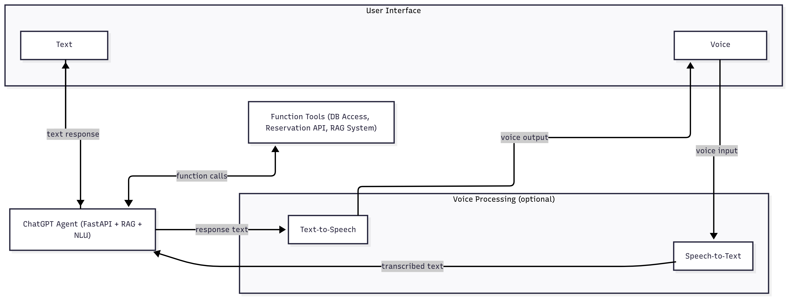

# 🔌 AI Voice Assistant for EV Management Platform

This project implements a voice-enabled AI assistant integrated within an electric vehicle (EV) management platform. It provides intelligent interactions for end-users and analytics capabilities for providers, leveraging state-of-the-art models for natural language understanding, retrieval-augmented generation (RAG), speech processing, and database function calling.

---

## 📌 Table of Contents

1. [Overview](#overview)  
2. [Core Features](#core-features)  
3. [Architecture](#architecture)  
4. [AI Modules](#ai-modules)  
    - [Tool Calling & Function Execution](#1-tool-calling--function-execution)  
    - [RAG: Retrieval-Augmented Generation](#2-rag-retrieval-augmented-generation)  
    - [Voice Chat: /voice Endpoint](#3-voice-chat--voice-endpoint)  
5. [System Instructions & Context Injection](#system-instructions--context-injection)  
6. [Technologies Used](#technologies-used)  
7. [Deployment & Hosting](#deployment--hosting)  

---

## 🧠 Overview

The assistant serves as the intelligent core of the EV platform, capable of:

- Handling user queries about charging sessions, transactions, energy usage, and EV-related knowledge.
- Executing reservations and performing database actions via OpenAI's function calling.
- Supporting voice interactions using OpenAI’s Whisper and TTS APIs.
- Delivering provider-level analytics through an integrated dashboard.
- Maintaining conversational memory to create seamless, multi-turn user experiences.

---

## 🚀 Core Features

- 🔎 Conversational insights into user history (sessions, payments, energy).
- 🧠 Knowledge delivery powered by a RAG system.
- 📈 Provider dashboard generation via data analysis.
- 🎙️ Fully voice-enabled interaction through `/voice` endpoint.
- 🔧 Reliable backend using FastAPI with clean function interfaces.

---

## 🏗️ Architecture


*Figure: High-level system architecture for the AI assistant, showing user interaction, voice processing, backend routing, and the overall flow.*
---

## 🧩 AI Modules

### 1. Tool Calling & Function Execution

The assistant is equipped with a suite of SQL-based tools that can be invoked automatically via OpenAI function calling. Each tool is defined in Python, mapped to a function schema, and performs a database query or action.

- Tools include:  
  `getMonthlySpending`, `getAvgTransactionAmount`, `getMaxTransactions`,  
  `getMonthlyEnergyUsage`, `getAvgSessionStats`, `getMostFrequentChargingWeekdays`,  
  `reserveSession`, `getNearestStations`, and others.
- Chat history is handled with helper functions to maintain context throughout the session.
- System instructions guide the model to only use available tools, format responses, and maintain domain boundaries.
- Each function receives a structured user ID context and returns relevant structured responses for display.

### 2. RAG: Retrieval-Augmented Generation

To handle open-ended EV knowledge queries (e.g., "What’s a CCS connector?"), the assistant uses a RAG pipeline:

- Vector store is populated with embedded documents about EV specifications, connectors, charger types, and platform FAQs.
- A retriever indexes and queries the documents to find context relevant to user questions.
- Retrieved data is embedded into the assistant’s prompt to ensure factually grounded responses without hallucinations.

### 3. Voice Chat: `/voice` Endpoint

The assistant supports full-duplex voice interaction through a unified `/voice` endpoint.

#### 🔊 Speech-to-Text (STT)

- Model Used: `whisper-1` via OpenAI API.
- Input: Audio (e.g., WAV, MP3).
- Audio is sent to the Whisper API and transcribed to text.
- Whisper-1 was selected for its multilingual accuracy and robustness to noise.

#### 🔈 Text-to-Speech (TTS)

- Model Used: `tts-1` via OpenAI API.
- Input: Text from assistant responses.
- Output: Natural-sounding audio generated in real-time and returned to the client.
- TTS-1 was chosen for its expressiveness, multilingual support, and low latency.

---

## 🧾 System Instructions & Context Injection

The system includes a customized instruction prompt injected at the start of each session:

- The assistant is aware of the user’s first and last name and instructed to address them personally.
- Current datetime is injected to allow time-aware interactions (e.g., scheduling).
- Instructions define scope (EV-specific), prohibit ID leakage, enforce markdown formatting, and guide tool invocation.
- Example flows (reservations, session history, station search) are provided to the model for consistency and reliability.

---

## 🧪 Technologies Used

| Tool           | Purpose                                               |
|----------------|--------------------------------------------------------|
| **FastAPI**    | High-performance backend for chat and voice endpoints |
| **OpenAI API** | Handles STT, TTS, and LLM chat responses              |
| **LangChain**  | Powers the RAG engine and tool integration            |
| **SQLAlchemy** | ORM for interacting with EV-related data              |
| **PostgreSQL** | Stores users, sessions, and vehicle metadata          |

---

## 🚀 Deployment & Hosting

This project can be hosted on Railway

**Procfile Example:**

```
web: uvicorn main:app --host=0.0.0.0 --port=8000
```

**Environment Variables:**

- `OPENAI_API_KEY`
- `DATABASE_URL` (or connection string)

Make sure all packages (e.g., `langchain`, `openai`, `uvicorn`, etc.) are listed in `requirements.txt`.

---